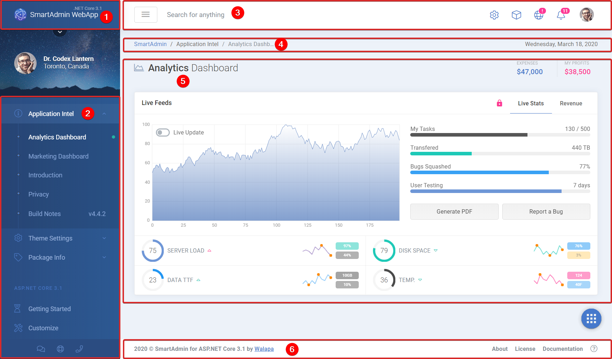

# SmartAdmin for ASP.NET Core 3.1 - Documentation

## Table of Contents

1. **[Introduction](introduction.md)**
1. **[Getting Started](getting-started.md)**
1. **Site Structure**
1. **[Solution Architecture](solution-architecture.md)**
1. **[Customization](customization.md)**
1. **[How To Contribute](howto-contribute.md)**
1. **[Licensing Information](licensing-information.md)**
1. **[Changelog](changelog.md)**

---

## Site Structure

The SmartAdmin Theme at its core is created using Bootstrap 4 components that create several "sections" of content that divide the webpages into logical content partitions. Throughout these **sections** various pieces of content and scripts are loaded to provide a rich, immerse and responsive experience. The focus here lies on presenting readable content using an intuitive structure that caters to the exact need of the SmartAdmin platform as a whole.

### Sections

To fully illustrate this concept, please take a look at the following image:



In the above image the following sections are highlighted:

1. Logo (Title)
1. Header (Search, Notifications, Login)
1. Aside (Navigation Card, Menu)
1. BreadCrumb (Location)
1. Content (Title, Subtitle and Main Content)
1. Footer (Version, Copyright)

The following sections are also present as part of the layout but are "non-visual":

- Head (CSS, FavIco, Fonts)
- Scripts (Core, Plugins, Validation, Analytics)

> **Note:** For more information about possible layouts and settings available to SmartAdmin please visit the [Layout](https://www.gotbootstrap.com/themes/smartadmin/4.4.1/settings_how_it_works.html) and [Settings](https://www.gotbootstrap.com/themes/smartadmin/4.4.1/settings_layout_options.html) pages on the HTML Preview site.

## Solution Structure

The SmartAdmin solution is divided into several projects and solution folders. Each project has its own set of responsibilities and determines its tie-in with other projects. The structure as a whole delivers a smooth coding experience whether you have been coding in Visual Studio for a long time, or when you are in the processing of mastering it.

The code, and certainly that which is part of the public API, have been provided with well written comments explaining why the code exists, what its goal is, and how it should be used and which conditions could cause it to fail. This principle and approach is also reflected in the naming of classes, methods and their properties to be as descriptive as possible to help deliver an intuitive coding experience and hopefully to invite **you** to start writing your own!

### Folders

| Folder | Purpose |
|---------|---------|
| `build` | Typically contains artifacts that might be required to (fully) build your project |
| `docs` | Contains the documentation you are currently reading and is a recommended place to store your own project documentation |
| `samples` | Typically contains sample projects that demonstrate certain key features or concepts of your application and/or libraries |
| `src` | Contains the main application and class libraries that make up your project |
| `tests` | Typically contains the companion test projects for each project in your solution |

### Solution Files

| File | Purpose |
|---------|---------|
| `.editorconfig` | Contains coding style and formatting configuration that Visual Studio can use |
| `.git*` | Files required for Git source control |
| `*.md` | Additional information about the Theme and Project |
| `SmartAdminCore.sln` | Solution file that should be opened with Visual Studio
| `NuGet.config` | Contains the feed sources that your projects can consume for NuGet packages |

### Application

There are a couple of main locations within the **SmartAdmin.WebUI** project that contain content files:

| Location | Purpose |
|---------|---------|
| `/Areas/Identity/**` | Contains views used for the Authentication part of the application |
| `/Pages/**` | Contains pages that are required for the **Razor Pages** based content of the application |
| `/Views/Shared/**` | Contains views that are required for the layout of the application |
| `/Views/Shared/Components/**` | Contains views that are required for the **ViewComponents** of the application |
| `/ViewComponents/**` | Contains view components that are used by the application, such as Navigation (Aside) |
| `/Views/**` | Contains views that are required for the **MVC** based content of the application |
| `/wwwroot/**` | Contains static assets of the application, such as CSS, JS and Fonts |

> **Note:** The above listing is based on the **Full** flavor of the Theme, some flavors may not include all listed folders in your solution.

### Navigation

The menu in rendered using the `nav.json` file from the root of the **SmartAdmin.WebUI** project. Although this could be replaced by using a different data source, we have chosen to use the file provided by the HTML Flavor of SmartAdmin. This ensures that with every update of the Theme the Menu changes accordingly.

The classes that are used by SmartAdmin and the model that is consumed by the ViewComponent have been constructed as such that it should be relatively easy to replace it with a database generated collection of menu items instead.

#### ViewComponent

The contents of the Menu is rendered using a [ViewComponent](https://docs.microsoft.com/en-us/aspnet/core/mvc/views/view-components). This ensures us that we can use a stand-alone data source that does not have to be fed through Controllers or other means.

```cs
public class NavigationViewComponent : ViewComponent
{
    public IViewComponentResult Invoke()
    {
        var items = NavigationModel.Full;

        return View(items);
    }
}
```

> **Note:** `NavigationModel.Full` can be replaced with `NavigationModel.Seed` to generate the **Seed** flavor menu.

The markup for the ViewComponent is located in: `/Views/Shared/Components/Navigation/Default.cshtml`.

#### Authorization

The `nav.json` file supports Authorization by specifying a `roles` array inside the structure. By default the MVC Flavor has been prepared to assign the **Administrator** role to the default user, as such that when Authorization is enabled on rendering the Navigation, certain elements from `nav.json` will not be rendered unless the same role is specified.

You can enable Authorization inside the ViewComponent `Default.cshtml` content by looking for this line:

```cs
@foreach (var group in Model.Lists)
```

And replacing it by the following line:

```cs
@foreach (var group in Model.Lists.AuthorizeFor(User))
```

---

Copyright &copy; 2020 by Walapa. All rights reserved. This documentation or any portion thereof
may not be reproduced or used in any manner whatsoever without the express written permission of the publisher except for the use of brief quotations in a review.
